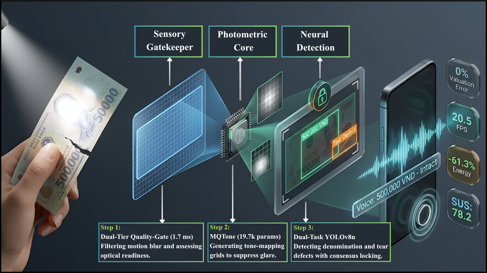
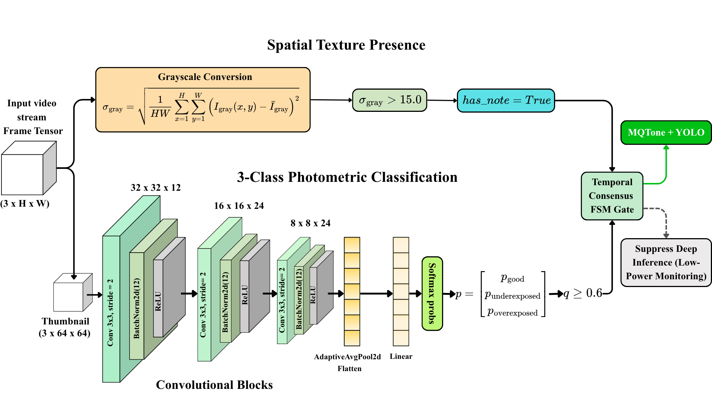
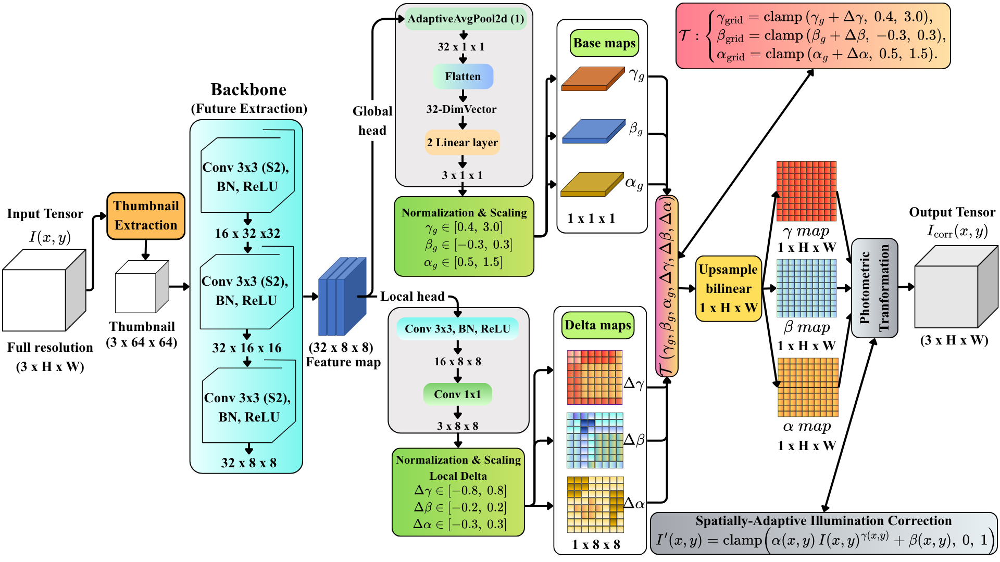
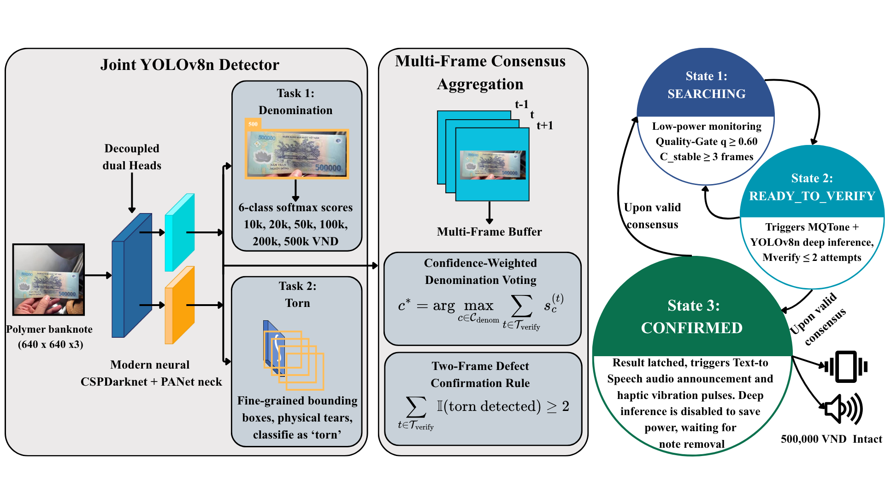

# CashVision: An On-Device Assistive Mobile Expert System for Autonomous Polymer Banknote Verification & Physical Defect Screening

<p align="center">
  
</p>

**CashVision** is a real-time, **100% offline** assistive mobile computer vision expert system designed to empower visually impaired and low-vision individuals to autonomously, safely, and independently verify Vietnamese polymer banknotes (VND) and inspect physical substrate damage (border tears and fractures).

CashVision comprehensively resolves severe specular glare and photometric degradation caused by non-porous polymer substrates (BOPP) under unconstrained ambient lighting, while strictly adhering to mobile SoC thermal ceilings ($<3.0$\,W) and interactive assistive response latency guidelines ($T_{\text{turnaround}} \le 1.5$\,s).

---

## Table of Contents
1. [Problem Formulation & Core Solution](#1-problem-formulation--core-solution)
2. [Expert System Architecture (Four Pillars)](#2-expert-system-architecture-four-pillars)
3. [Declarative Knowledge Base & Formal Rule Set (R1–R8)](#3-declarative-knowledge-base--formal-rule-set-r1r8)
4. [Integrated Deep Vision Models (100% Offline)](#4-integrated-deep-vision-models-100-offline)
5. [Android Application Features & Assistive UX](#5-android-application-features--assistive-ux)
6. [Application Codebase Structure](#6-application-codebase-structure)
7. [Installation & Deployment Guide](#7-installation--deployment-guide)

---

## 1. Problem Formulation & Core Solution

### Real-World Assistive Challenges
* **Polymer Substrate Reflection (BOPP)**: Polymer banknotes feature ultra-smooth, specular surfaces and transparent diffractive optical windows. Under direct sunlight or indoor luminaires, intense localized glare blows out camera sensors, saturating pixels and obliterating typographic numerals and intaglio engravings.
* **Unconstrained Ambient Environments**: Assistive users interact under adverse lighting regimes—such as high-intensity outdoor sunlight, strong directional window backlighting, or severe lamp glare—frequently compounded by natural handheld motor tremor.
* **Severe Financial Valuation Hazards**: Polymer currency prone to fold fatigue often develops mechanical tears along borders that risk transaction rejection at points of sale. More critically, misclassifying denominations (e.g., mistaking 20,000 VND for 500,000 VND) inflicts irreversible monetary loss.
* **Mobile Thermal and Energy Bottlenecks**: Continuously running heavy deep convolutional detectors uniformly across every incoming video frame induces rapid SoC thermal throttling ($>42.5^\circ\text{C}$), drops throughput below 3.5 FPS, and depletes battery autonomy.

### CashVision's Breakthrough Solution
CashVision decouples lightweight video buffer monitoring from compute-intensive neural inference via a **Rule-Governed Adaptive Cascade Expert System**:
* **Zero-Inference Sensory Screening**: Discards featureless frames (pockets, blank tables) in $<0.05$\,ms and screens photometric readiness in $1.70$\,ms before triggering deep inference.
* **Learnable Tone-Mapping Enhancement (MQTone)**: Adaptively suppresses localized specular glare highlights and recovers obscured contrast prior to detection.
* **Temporal Consensus Multi-Frame Arbitration**: Enforces evidence accumulation across candidate verification bursts, eliminating single-frame fold crease false alarms and motion-blur hazards.
* **Post-Confirmation Transactional Latching**: Once verified, the system suppresses further deep neural executions, slashing amortized frame latency by $97.9\%$ and saving over $34.6\%$ energy.

---

## 2. Expert System Architecture (Four Pillars)

CashVision structurally decomposes into the four classical pillars of an expert system:

```
Incoming Camera Stream (Android CameraX @ 20.5 FPS)
         │
         ▼
┌─────────────────────────────────────────────────────────────┐
│ 1. KNOWLEDGE BASE & SENSORY SCREENING                       │
│    • R1: Spatial Texture Gating (σ_gray > 15.0)    [<0.05ms]│──► Featureless / Occluded (Suppress)
│    • R2: Photometric Readiness (q ≥ 0.60)           [1.70ms]│──► Specular Glare / Low-Light (Defer)
└─────────────────────────────────────────────────────────────┘
         │ (Accumulate K_opt = 3 consecutive stable frames - R3)
         ▼
┌─────────────────────────────────────────────────────────────┐
│ 2. TEMPORAL CONSENSUS INFERENCE ENGINE (3-STATE FSM)        │
│    SEARCHING ──────► READY_TO_VERIFY ──────► CONFIRMED      │
└─────────────────────────────────────────────────────────────┘
         │ (Trigger bounded verification burst M_verify ≤ 2 - R4)
         ▼
┌─────────────────────────────────────────────────────────────┐
│ 3. META-LEVEL CONTROL & NEURAL RESTORATION                  │
│    • MQTone: Glare suppression & contrast recovery [23.2ms] │
│    • YOLOv8n: Joint denomination & tear detection   [180ms] │
│    • R5: Post-NMS Candidate Filtering (conf ≥ 0.25)         │
│    • R6: Multi-frame confidence consensus voting (c*)       │
│    • R7: Two-frame defect persistence filter                │
└─────────────────────────────────────────────────────────────┘
         │ (Consensus verified -> Latch confirmation - R8)
         ▼
┌───────────────────────────────────────────────────────────────┐
│ 4. EXPLANATION FACILITY (TRANSLATIVE MULTIMODAL INTERFACE)    │
│    • Natural Speech Synthesis (Android TTS: English & VN)    │
│    • Structured Haptic Feedback (Single: Intact / Dual: Torn)│
│    • Dynamic Bounding Box Overlay & Live Rules Monitor (R1-R8)│
└───────────────────────────────────────────────────────────────┘
```

---

## 3. Declarative Knowledge Base & Formal Rule Set (R1–R8)

All operational transitions, sensory triage, and safety arbitration are governed by 8 declarative rules:

| Rule | Functional Role | Antecedent / Logical Condition | Consequent / Operational Action | Knowledge Source & Assistive Rationale |
| :---: | :--- | :--- | :--- | :--- |
| **$R_1$** | **Spatial Texture Gating** | $\sigma_{\text{gray}} \le \theta_{\text{texture}}$ <br> ($\theta_{\text{texture}} = 15.0$) | Assert `has_note = False`; suppress inference; remain in $\texttt{SEARCHING}$. | Featureless non-target frames (pockets, blank tabletops) exhibit negligible luminance variance ($<0.05$\,ms). |
| **$R_2$** | **Photometric Readiness** | $q < \tau$ ($\tau = 0.60$) or <br> $\mathbb{I}_{\text{degraded}} = \text{True}$ ($q < 0.40$) | Invalidate optical readiness; reset $c_{\text{stable}} \leftarrow 0$; provide lighting cues. | Severe specular overexposure or underexposure degrades detector feature maps beyond operational safety. |
| **$R_3$** | **Temporal Stability** | $(\sigma_{\text{gray}} > 15.0) \land (q \ge 0.60)$ sustained for $\ge K_{\text{opt}} = 3$ frames | Transition FSM: $\texttt{SEARCHING} \to \texttt{READY\_TO\_VERIFY}$; open burst window. | A 3-frame ($\approx 100$\,ms) dwell filters transient hand tremor while keeping latency well within interactive limits. |
| **$R_4$** | **Verification Burst Budget** | Active attempts $m \ge M_{\text{verify}} = 2$ without consensus | Terminate burst; reset $c_{\text{stable}} \leftarrow 0$; safely return to $\texttt{SEARCHING}$. | Caps active compute per verification burst ($\le 2 \cdot T_{\text{Full}}$), preventing thermal surge and palm heating. |
| **$R_5$** | **Candidate Filtering** | Bounding box confidence $\text{conf}(b) < \theta_{\text{conf}} = 0.25$ | Discard bounding box $b$ as noise; exclude from consensus voting. | Ultralytics standard post-NMS detection confidence threshold for YOLO architectures. |
| **$R_6$** | **Denomination Consensus** | Candidates in burst yield: <br> $c^* = \arg\max_c \sum_{t} s_c^{(t)}$ | Finalize denomination $c^*$; transition FSM: $\texttt{READY\_TO\_VERIFY} \to \texttt{CONFIRMED}$. | Multi-frame confidence summation ensures consistent, high-certainty hypotheses override single-frame viewpoint jitter. |
| **$R_7$** | **Two-Frame Defect Persistence** | Defect class $\texttt{torn}$ satisfies $\sum_{t} \mathbb{I}(\text{conf}_{\text{torn}} \ge \theta_{\text{conf}}) \ge 2$ | Confirm physical tear ($\hat{y}_{\text{torn}} = 1$); trigger dual-pulse haptic cue & tear alert. | **Suppresses False Alarms**: Transient specular highlights disperse across view angles, whereas genuine substrate tears persist across successive viewpoints. |
| **$R_8$** | **Dual-Condition Latch Reset** | In $\texttt{CONFIRMED}$: <br> (a) $\sigma_{\text{gray}} \le 15.0$ <br> (b) $\|\bar{I}_t - \bar{I}_{\text{latched}}\| > 25.0$ <br> (c) Periodic 1.5s check fails | Reset latched hypothesis; transition FSM back to $\texttt{SEARCHING}$; unlock for next note. | Automatically unlocks the scanning session upon banknote withdrawal into pockets or replacement with a new note. |

---

## 4. Integrated Deep Vision Models (100% Offline)

All neural sub-networks are compiled to native **ONNX Runtime mobile format**, executing multi-threaded (2 threads) on the smartphone's ARM CPU without requiring any cloud or internet connection:

<p align="center">
  
  &nbsp;&nbsp;
  
</p>

1. **Quality-Gate (`quality_gate.onnx` - 46 KB)**:
   * **Input**: $64 \times 64 \times 3$ thumbnail.
   * **Function**: 3-class photometric classification (`good`, `underexposed`, `overexposed`) paired with spatial texture standard deviation $\sigma_{\text{gray}}$.
   * **Execution Latency**: $1.70 \pm 0.04$\,ms on mobile CPU.

2. **MQTone (`mqtone.onnx` - 125 KB)**:
   * **Input**: $640 \times 640 \times 3$ tensor.
   * **Function**: Micro-scale Quality Tone-mapping Network ($19{,}686$ parameters). Predicts global illumination parameters $(\alpha_g, \beta_g, \gamma_g)$ and localized $8 \times 8$ residual grids to suppress localized polymer specular glare without distorting native banknote chromaticity.
   * **Execution Latency**: $23.2$\,ms on mobile CPU.

3. **Dual-Task YOLOv8n (`yolov8n_cashvision.onnx` - 12.8 MB)**:
   * **Input**: Restored $640 \times 640 \times 3$ image.
   * **Dual Function**:
     * *Task 1*: Predicts bounding boxes and identifies all 6 Vietnamese polymer denominations (`10k`, `20k`, `50k`, `100k`, `200k`, `500k` VND).
     * *Task 2*: Concurrently localizes physical substrate fractures and edge tears (`torn`).
   * **Execution Latency**: $\approx 180 - 200$\,ms on mobile CPU.

---

## 5. Android Application Features & Assistive UX

The CashVision mobile application is built in Kotlin with modern **Glassmorphism Dark Mode Aesthetics** compliant with international assistive accessibility standards:

<p align="center">
  
</p>

### Key User Interface Elements
* **Viewfinder Scanner Reticle**: 1.85:1 aspect-ratio target guide tailored to Vietnamese polymer currency with breathing cyan laser corner brackets during search mode.
* **Live Dynamic Bounding Box Overlay**:
  * Glowing **Emerald Green** bounding box tracking the banknote with confidence score when intact.
  * Pulsing **Coral Red** bounding box with localized dashed boxes and `[TORN DEFECT]` badges highlighting physical tear locations.
* **FSM State Indicator**:
  * `SEARCHING FOR BANKNOTE` (Low-power monitoring)
  * `HOLD STEADY • VERIFYING` (Optical stability confirmed, burst active)
  * `VERIFIED & CONFIRMED` (Transactional latch active, conserving energy)
* **Prominent Hero Result Display**:
  * High-contrast, large-format denomination display (e.g., `500,000 ₫`, `200,000 ₫`) with typography color dynamically matching the authentic banknote palette.
  * Structural status pills: `BANKNOTE INTACT` or `TORN DEFECT DETECTED`.

### Multimodal Assistive Features
* **Natural Speech Synthesis (Android TTS)**: High-clarity vocal announcements communicating verified currency value and defect integrity (e.g., *"500 thousand Dong, banknote intact"* or *"20 thousand Dong, warning: torn defect detected"*).
* **Differentiated Structured Haptic Feedback**:
  * **Intact Banknote**: Single crisp vibrational pulse ($150$\,ms).
  * **Torn Banknote**: Distinct dual-pulse pattern ($100$\,ms buzz – $80$\,ms pause – $150$\,ms buzz), enabling immediate tactile recognition without visual or auditory dependence.
* **CameraX Flashlight Torch Toggle**: One-touch illumination assistance for dim and dark environments.
* **Instant Bilingual Toggle**: Seamless one-tap language switching between **English (EN)** and **Vietnamese (VI)**.
* **Manual Unlock Button**: Touch action to reset the FSM latch and scan a new banknote immediately.
* **Knowledge Base & Telemetry Diagnostics Drawer**: Expandable diagnostic dashboard monitoring real-time evaluations of Rules $R_1 - R_8$, preview throughput (20.5 FPS), latency breakdown, SoC discharge current (mA), instantaneous power (W), and cumulative session energy (Joules).

---

## 6. Application Codebase Structure

The `app_cashvision/` directory contains the complete native Android project:

```
app_cashvision/
├── app/
│   ├── src/
│   │   └── main/
│   │       ├── AndroidManifest.xml          # Camera, Vibration, and Hardware permissions
│   │       ├── assets/                      # Bundled ONNX Runtime deep neural models
│   │       │   ├── quality_gate.onnx        # Optical screening classifier (46 KB)
│   │       │   ├── mqtone.onnx              # Photometric tone-mapping network (125 KB)
│   │       │   └── yolov8n_cashvision.onnx  # Dual-task detector (12.8 MB)
│   │       ├── java/com/cashvision/app/
│   │       │   ├── MainActivity.kt          # CameraX stream, TTS dispatch, Haptics & UI orchestration
│   │       │   ├── CascadeController.kt     # Temporal Consensus FSM & Rules Engine (R1–R8)
│   │       │   ├── OverlayView.kt           # Viewfinder reticle, dynamic bounding boxes & tear highlights
│   │       │   ├── OnnxInferenceEngine.kt   # Native C++ ONNX Runtime inference engine (2 threads)
│   │       │   ├── BatteryMeter.kt          # BatteryManager current (mA), voltage (mV) & energy (J)
│   │       │   └── SessionLogger.kt         # Live telemetry & field trial session logger
│   │       └── res/
│   │           ├── drawable/                # Glassmorphism rounded shapes, badges & action buttons
│   │           ├── layout/activity_main.xml # Modern responsive accessibility layout
│   │           └── values/                  # Currency color palettes, themes, and English/Vietnamese strings
│   ├── build.gradle.kts                     # CameraX, ONNX Runtime, Material Design dependencies
│   └── proguard-rules.pro
├── gradle/wrapper/                          # Gradle Wrapper 8.4
├── gradlew & gradlew.bat                    # Cross-platform Gradle automation scripts
├── build.gradle.kts
├── settings.gradle.kts
└── gradle.properties                        # OpenJDK 17 and compilation JVM settings
```

---

## 7. Installation & Deployment Guide

### System Requirements
* Operating System: **Android 7.0 (API Level 24)** or higher (Recommended: Android 12 to 14+).
* Rear camera with auto-focus support.
* Storage: Minimum $150$\,MB free space.
* **100% Offline**: No cellular data or Wi-Fi connection required.

---

### Option 1: Direct APK Installation (Fastest)
1. Copy the pre-compiled debug APK to your Android device:
   ```
   app_cashvision/app/build/outputs/apk/debug/app-debug.apk
   ```
2. On your phone, tap `app-debug.apk` and grant permission to *Install unknown apps*.
3. Launch **CashVision** and grant the **Camera** permission upon first launch.
4. Position any polymer banknote before the camera to experience automated recognition.

---

### Option 2: Open and Run with Android Studio
1. Launch **Android Studio** (Giraffe, Hedgehog, or newer).
2. Select **Open** and navigate to `f:\CashVision\app_cashvision`.
3. Allow Gradle to synchronize project dependencies (configured with JDK 17).
4. Connect an Android device via USB with **USB Debugging** enabled.
5. Press **Shift + F10** or click **Run** to compile and launch the application directly onto the device.

---

### Option 3: Command-Line Build
To build a fresh APK from the terminal:

```bash
cd app_cashvision

# Windows PowerShell:
.\gradlew.bat assembleDebug

# Linux / macOS:
chmod +x gradlew
./gradlew assembleDebug
```
The output APK will be generated at `app/build/outputs/apk/debug/app-debug.apk`.
