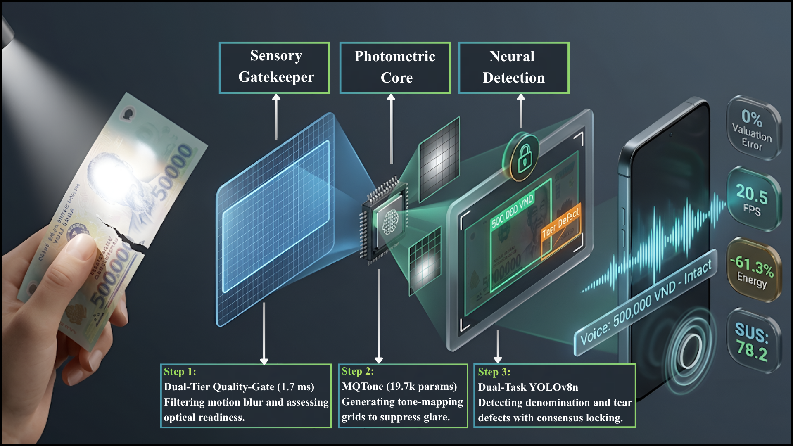
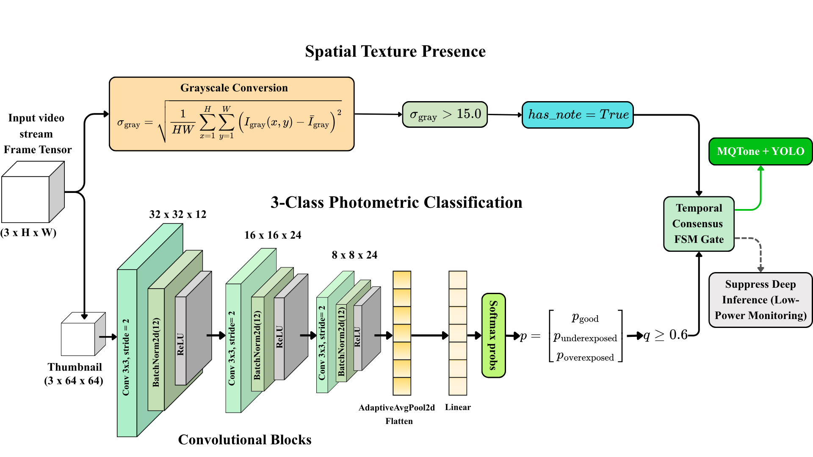
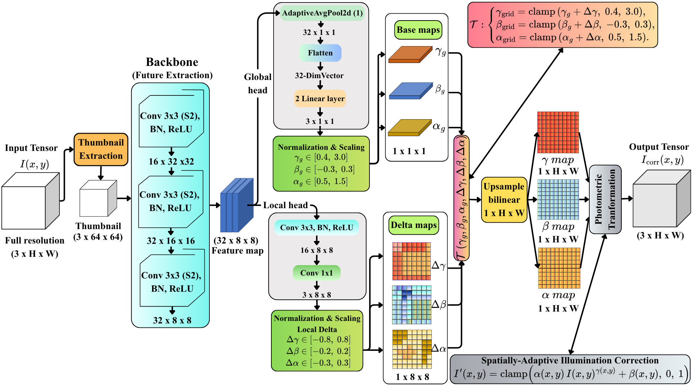
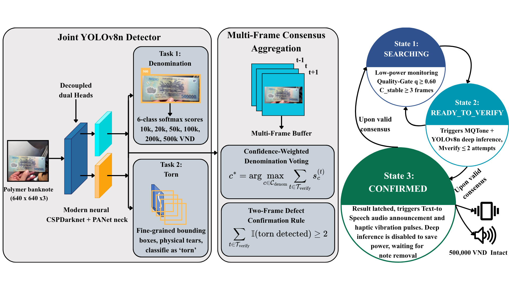

# CashVision: A Real-Time, Energy-Efficient Mobile Banknote Reader and Defect Screening Pipeline for Polymer Currency

<p align="center">
  
</p>

[-007acc.svg)](https://www.springer.com/journal/11554)
[-green.svg)](https://developer.android.com/)
[-orange.svg)]()
[](LICENSE)

**CashVision** is an on-device, **100% offline real-time computer vision pipeline** engineered for commodity mobile SoCs. It empowers visually impaired individuals to autonomously verify Vietnamese polymer currency (VND) and screen physical substrate tears under severe specular glare, motion blur, and unconstrained ambient lighting.

By decoupling continuous camera buffer monitoring from compute-intensive neural inference via an **event-driven cascaded architecture**, CashVision achieves a camera-limited **20.5 FPS preview throughput**, cuts active power consumption by **35.3%–36.5%** ($<3.0$\,W thermal envelope), and slashes amortized per-frame latency by **97.9%** ($\mathbb{E}[T_{\text{frame}}] \approx 3.36$\,ms), strictly meeting interactive assistive real-time deadlines ($T_{\text{turnaround}} \le 1.02$\,s).

---

## Key Real-Time Benchmarks (Samsung Galaxy A54)

| Metric | CashVision (Proposed) | Per-Frame Full Inference ($B_0$) | Timer-Triggered Single Shot ($B_1$) |
| :--- | :---: | :---: | :---: |
| **Preview Throughput** | **20.5 FPS** (camera-limited) | 3.24 FPS | N/A (single capture) |
| **Mean Frame Latency** | **$3.36$\,ms** ($6.50$\,ms w/ CameraX) | 308.1\,ms | 308.1\,ms (on-trigger) |
| **Active Power / Thermal**| **$\approx 2.85$\,W** (no throttling) | 4.39\,W (throttles $<60$\,s) | Transient low power |
| **Single-Burst Turnaround**| **$0.56$\,s – $0.87$\,s** ($m \le 2$) | Constant per-frame | Blind trigger time |
| **Wrong Denominations** | **0 / 60 live sessions** ($0\%$) | High risk under motion | 5 / 36 sessions ($13.9\%$) |
| **Substrate Tear Screening**| **10 / 12 live torn detected** (0 false alarms)| No temporal filter | High false-positive rate |

---

## Real-Time Cascaded Stream Architecture

The CashVision stream processing pipeline is organized into a four-stage hierarchical cascade optimized for real-time edge execution:

```
Incoming Camera Stream (Android CameraX @ 20.5 FPS Preview)
         │
         ▼
┌─────────────────────────────────────────────────────────────┐
│ STAGE 1: ZERO-INFERENCE SENSORY TRIAGE & OPTICAL GATING     │
│    • R1: Spatial Texture Gating (σ_gray > 15.0)    [<0.05ms]│──► Featureless / Occluded (Suppress)
│    • R2: Photometric Readiness (q ≥ 0.60)           [1.70ms]│──► Specular Glare / Low-Light (Defer)
└─────────────────────────────────────────────────────────────┘
         │ (Accumulate K_opt = 3 consecutive stable frames - R3)
         ▼
┌─────────────────────────────────────────────────────────────┐
│ STAGE 2: TEMPORAL CONSENSUS STREAM CONTROLLER (3-STATE FSM) │
│    SEARCHING ──────► READY_TO_VERIFY ──────► CONFIRMED      │
└─────────────────────────────────────────────────────────────┘
         │ (Trigger bounded verification burst M_verify ≤ 2 - R4)
         ▼
┌─────────────────────────────────────────────────────────────┐
│ STAGE 3: LOW-LATENCY RESTORATION & DUAL-TASK DEEP INFERENCE │
│    • MQTone: Photometric glare suppression          [23.2ms]│
│    • YOLOv8n: Joint denomination & tear detection   [180ms] │
│    • R5: Post-NMS Candidate Confidence Filter (conf ≥ 0.25) │
│    • R6: Multi-frame confidence consensus voting (c*)       │
│    • R7: Two-frame defect temporal persistence filter       │
└─────────────────────────────────────────────────────────────┘
         │ (Consensus verified -> Latch confirmation state - R8)
         ▼
┌─────────────────────────────────────────────────────────────┐
│ STAGE 4: MULTIMODAL LOW-LATENCY ACTUATION & ASSISTIVE UX    │
│    • High-Clarity Speech Synthesis (Android TTS: EN & VI)   │
│    • Structured Haptic Feedback (Single: Intact /Dual: Torn)│
│    • Real-Time Viewfinder Reticle & Telemetry Overlay       │
└─────────────────────────────────────────────────────────────┘
```

---

## Stream Control Policies & Decision Rules (R1–R8)

| Rule | Role | Condition | Operational Stream Action & Real-Time Rationale |
| :---: | :--- | :--- | :--- |
| **$R_1$** | **Texture Gating** | $\sigma_{\text{gray}} \le 15.0$ | Discard featureless frames (pockets, blank tables) in $<0.05$\,ms without neural overhead. |
| **$R_2$** | **Photometric Quality** | $q < 0.60$ or degraded | Defer ambiguous/glare frames ($1.70$\,ms) to prevent asymmetric denomination errors. |
| **$R_3$** | **Stability Window** | Stable for $K_{\text{opt}} = 3$ frames | Transition $\texttt{SEARCHING} \to \texttt{READY\_TO\_VERIFY}$ ($\approx 150$\,ms dwell filters hand tremor). |
| **$R_4$** | **Burst Budget** | $m \ge M_{\text{verify}} = 2$ without consensus | Cap compute at $\le 2 \cdot T_{\text{Full}} \approx 616$\,ms; abort to $\texttt{SEARCHING}$ to avoid thermal surge. |
| **$R_5$** | **Candidate Filter** | $\text{conf}(b) < 0.25$ | Discard low-confidence bounding boxes from consensus voting. |
| **$R_6$** | **Denomination Vote** | $c^* = \arg\max_c \sum_t s_c^{(t)}$ | Multi-frame confidence summation finalizes denomination; advance to $\texttt{CONFIRMED}$. |
| **$R_7$** | **Defect Persistence** | $\ge 2$ torn detections in burst | Confirm physical tear ($\hat{y}_{\text{torn}} = 1$); suppresses single-frame fold crease false alarms. |
| **$R_8$** | **Latch Release** | $\sigma_{\text{gray}} \le 15$ or $\|\Delta \bar{I}\| > 25$ | Lock confirmed state (duty cycle $0.54\%$, saves $35.5\%$ energy); unlock on note removal. |

---

## Edge-Optimized Neural Models (100% Offline)

All neural networks run via **native ONNX Runtime C++ (2 ARM CPU threads)** without internet access:

<p align="center">
  
  &nbsp;&nbsp;
  
</p>

1. **Quality-Gate (`quality_gate.onnx` - 46 KB, $8{,}295$ params)**:
   * 3-class photometric classifier (`good`, `under`, `over`) on a $64\times 64$ thumbnail.
   * Latency: **$1.70 \pm 0.04$\,ms** on mobile ARM CPU.
2. **MQTone (`mqtone.onnx` - 125 KB, $19{,}686$ params)**:
   * Dual-head affine-gamma enhancer (global curve + $8\times 8$ local residual grid) suppressing polymer specular glare.
   * Latency: **$23.2$\,ms** ($18.4$\,ms forward pass + $4.8$\,ms interpolation & SIMD tone correction).
3. **Dual-Task YOLOv8n (`yolov8n_cashvision.onnx` - 12.3 MB, $3.2$\,M params)**:
   * Jointly classifies 6 VND denominations (`10k`–`500k`) and localizes substrate edge tears (`torn`).
   * Latency: **$\approx 180 - 200$\,ms** on mobile CPU.

---

## Assistive UX & Multimodal Interface

<p align="center">
  
</p>

* **Assistive Viewfinder Reticle**: 1.85:1 target guide with dynamic emerald green (intact) or coral red (torn defect) bounding boxes.
* **Multimodal Speech & Haptics**: High-clarity bilingual TTS (English / Vietnamese) paired with structured tactile pulses:
  * **Intact Note**: Single crisp pulse ($150$\,ms).
  * **Torn Note**: Distinct dual-pulse pattern ($100$\,ms buzz – $80$\,ms pause – $150$\,ms buzz) for non-visual defect recognition.
* **Telemetry Diagnostics Drawer**: Real-time dashboard monitoring Rules $R_1 - R_8$, live FPS ($20.5$), per-module latency, current (mA), power (W), and energy (J).

---

## Application Codebase Structure

```
app_cashvision/
├── app/src/main/
│   ├── AndroidManifest.xml          # Camera, Vibration, and Hardware permissions
│   ├── assets/                      # Bundled ONNX models (quality_gate, mqtone, yolov8n)
│   ├── java/com/cashvision/app/
│   │   ├── MainActivity.kt          # CameraX stream, TTS dispatch, Haptics & UI orchestration
│   │   ├── CascadeController.kt     # Temporal Consensus FSM & Rules Engine (R1–R8)
│   │   ├── OverlayView.kt           # Viewfinder reticle, dynamic bounding boxes & tear highlights
│   │   ├── OnnxInferenceEngine.kt   # Native C++ ONNX Runtime engine (2 ARM CPU threads)
│   │   ├── BatteryMeter.kt          # BatteryManager current (mA), voltage (mV) & energy (J)
│   │   └── SessionLogger.kt         # Live telemetry & field trial session logger
│   └── res/                         # Glassmorphism dark UI layout, drawables & strings
└── build.gradle.kts                 # CameraX & ONNX Runtime dependencies
```

---

## Installation & Deployment Guide

* **Requirements**: Android 7.0+ (API 24+), rear auto-focus camera, $\ge 150$\,MB free storage. **100% Offline**.

### Option 1: Direct APK Installation (Fastest)
Copy and install the pre-compiled debug APK directly to your Android device:
```
app_cashvision/app/build/outputs/apk/debug/app-debug.apk
```

### Option 2: Open and Run with Android Studio
1. Open `f:\CashVision\app_cashvision` in **Android Studio** (Giraffe or newer).
2. Connect an Android device with **USB Debugging** enabled.
3. Press **Shift + F10** or click **Run**.

### Option 3: Command-Line Build
```bash
cd app_cashvision
.\gradlew.bat assembleDebug   # Windows PowerShell
./gradlew assembleDebug       # Linux / macOS
```
Output APK: `app/build/outputs/apk/debug/app-debug.apk`.
